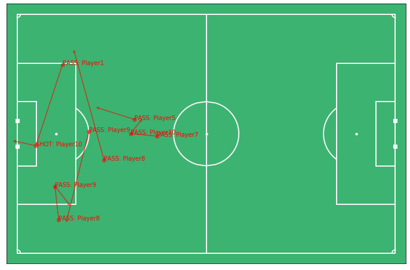

# Metrica Tracking and Event Data

Metrica data can be found **<a href="https://github.com/metrica-sports/sample-data">HERE</a>**

Also, accompanying video tutorials can be found **<a href="https://www.youtube.com/watch?v=5X1cSehLg6s">HERE</a>**

All plots and results mentioned below can be found above if not displayed.

To begin with, the first script will look at working with Metrica Sport's player tracking and event data. Options for visualising the data, and using tracking data to add context to shot maps and passing maps. The script begins with plotting not only the first home goal start location, but where it ends up too, this can be useful because we can then see what event sequences leading up to the goal and if teams have particular patterns.

It may not be the clearest at a glace but, you can see the gaps are where the ball has been carried, for example player 8 has carried the ball from the left wing into zone 14. Next we plot the tracking data for five players for the first 1,500 frames, from what returns I would guess these five players are the defenders and goalkeeper, tracking back after losing possession from kick-off. A useful feature with the Metrica data is how it's perfectly synchronised the event is with the tracking data, allowing us the plot every players starting position in a loop at the start of a match. Using this method, we can now see where each player was when the first home goal went in. This gives us much more context about the goal, how much pressure was the shot taker under or the players around him.

The second script is using tracking data to add further context to football analytics. I have created a small movie for each of the goals scored in the sample game which can be found above. Because the tracking data holds a player position ever 40 milliseconds for each row, we can measure player velocity. By plotting a random frame from the game, we can see what direction a player is moving and at what speed from the length of the arrow.

A common stat in football is distant covered, if we can calculate the velocity then we could also see how far a player has walked, jogged, ran and sprant in a game. We can see the results of this by createing a clustered bar chart.

Script three will help you build your own pitch control model in python and using it to evaluate a player's passing options. Pitch control measures the probability that a team will retain possession of the ball if they pass it to another location on the field. It can be used to evaluate passing options for a player, and quantify the probability of success. First, we plot the three passes that lead upto the first away goal, from this we can then plot the pitch control model from the instance of the first pass, to the assist. Analysing one of the passes, we can see that player 19 has control of the ball and because of the run from player 23, there has opened a great opportunity to pass the ball into the box.

To take this a step further, we can look at where the best valued pass is at a specific instance. To do so, the script collects all the home team passes before looping through every start and end pass location and then run the pitch control model to calculate the success possibility, from that we can produce it on a histogram. Looking at the 'risky' passes (less than 0.5 success possibility) we can see that the majority of passes are long balls or clearances from their own half and attempts into the opponents box. 

Measuring the quality of player decision-making and valuing their actions. This tutorial introduces the concept of expected possession value (EPV), describes how to use EPV to quantify the value of passes, and demonstrates how you can combine EPV with pitch control to identify the best passing options available to the player on the ball. In the example I am using here, shows that getting the ball into the box would have the highest value in this situation. However, you can have a possitive expected value for a pass even if it away from the goal. The reason for that is if possesion is retained or not, although, pass control doesn't take interceptions into account!

For the next example, we have gone through all the home team passes and calculated the EPV like before but also found the maximum EPV with it in a list. Looking at some of the events from the list, we can see there are a few cross-field passes that had a significantly high EPV than the passes that were actually made.

# What I Learnt

- Using tracking data to add context to shot and pass maps
- Calculating player velocties
- Creating bespoke physical summary reports
- Implementing a pitch control model
- Evaluating pass options
- Measuring expected possession value (EPV)
- Valuing decision-making and actions
